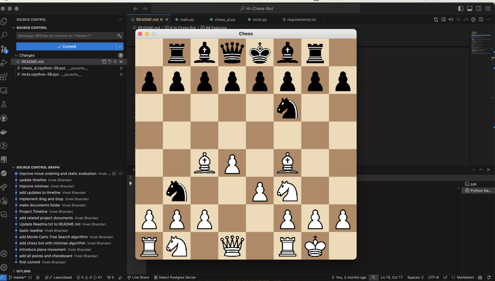

# AI Chess Bot

## Table of Contents
1. [Introduction](#introduction)
2. [Features](#features)
3. [Installation](#installation)
4. [Usage](#usage)
5. [Contributing](#contributing)
6. [Credits](#credits)

## Introduction
The purpose of this project was to develop an AI chess bot that can play chess against human opponents! Ive played chess every since I was young and I always wondered how chess bots worked. The project started with understanding the basics of chess and simple AI techniques, gradually advancing to more complex algorithms like Minimax with Alpha-Beta Pruning. The project is implemented using python, taking advantages of libraries such as Pygame and Python-Chess.

## Features
  - Easy-to-use interface for chess games.
  - AI opponent using Minimax algorithm with Alpha-Beta Pruning.

## Installation

### Prerequisites
- Python 3
- Pygame
- Python-Chess

### Steps
1. Clone the repository:
   ```
   git clone https://github.com/vivek02172003/AI-Chess-Bot.git
   cd AI-Chess-Bot
   ```
2. Install the dependencies:
    ```
    pip install -r requirements.txt
    ```

## Usage
To run the game, execute the following command in the root of project:

```bash
python main.py
```
Use your mouse to drag and drop the pieces on the board.

## Screenshots

Here is a screenshot of the game in action:


## Contributing

We welcome contributions! If you would like to contribute to the project, follow these steps:

1. Fork the repository.
2. Create your feature branch (`git checkout -b feature/awesome-feature`).
3. Commit your changes (`git commit -am 'Add awesome feature'`).
4. Push to the branch (`git push origin feature/awesome-feature`).
5. Create a new Pull Request.


## Credits

Special thanks to contributors and libraries such as Pygame and Python-Chess.